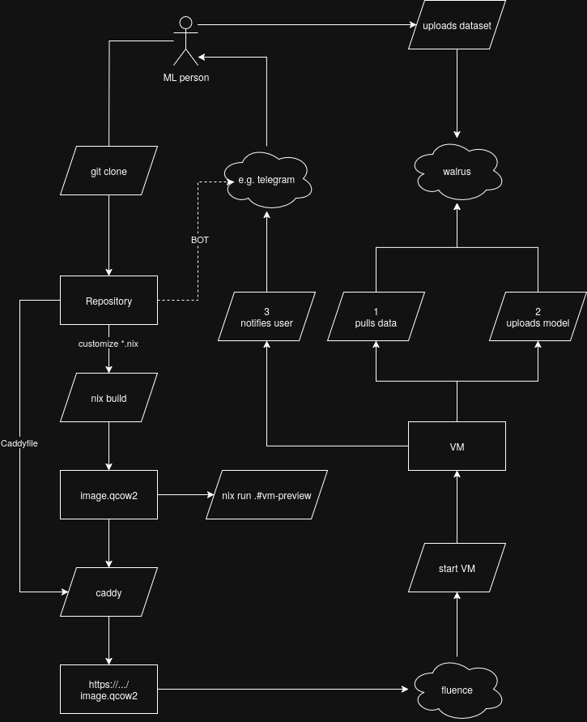
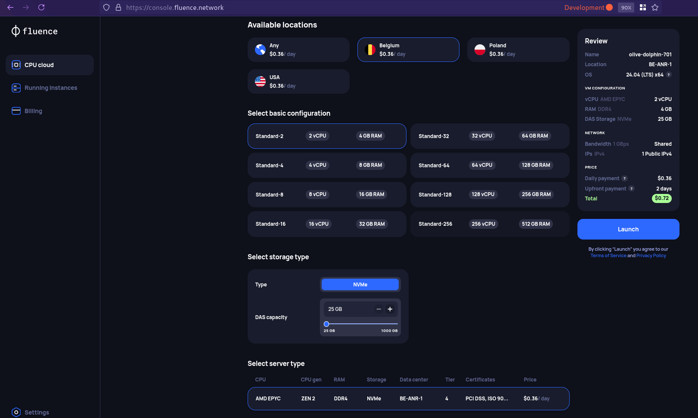
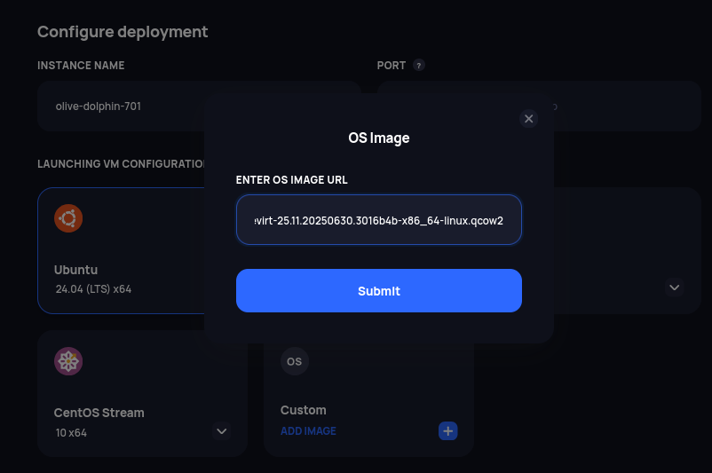

# That's OK-AI Folks

This is the repository for a blockchain-based host configuration to perform
model training automatically.

This uses:

1. https://www.fluence.network/ decentralized compute-as-a-service
2. https://www.walrus.xyz/ for storage (input data and model output)

The purpose of this software is to provide a easy-to-make virtual compute image
that can be use to perform distributed training of machine learning models, with
blockchain backed verification of source data and produced models.


## Usage



This repo is self-container to get an up-and-running image, but it's using
test networks. To use this, you need a fluence account and a public-facing host
with nix or nixos on it (with port 8080 open to the world).

1. enter your nix host (e.g. `foo.example.com`) and clone this repository;
2. customize the files according to your needs:
   - `flake.nix`: contains the endpoints (see `aggregator` and `publisher`);
   - `configuration.nix`: with your users, ssh keys, programs, settings and so on;
   - `walrus-puller.nix`: to pull your training data
   - `model-trainer.nix`: to train your model
   - `walrus-pusher.nix`: to push your output model
3. build the image using `nix build`, this produces a `./result` directory with
   your image file (e.g. `nixos-image-kubevirt-25.11.20250630.3016b4b-x86_64-linux.qcow2`)
4. start a web server to serve the image
5. from fluence console, remember to specify the url of your image, say
   `https://foo.example.com/images/nixos-image-kubevirt-25.11.20250630.3016b4b-x86_64-linux.qcow2`
   before starting the machine. At the time of writing, fluence **does not**
   insert your ssh keys from the control panel when using a custom image, so
   you will need to set them in your `configuration.nix` or set a password.

In this repo, there are some more things that are useful for testing and demoing:

1. a Telegram bot script that can be used to collect notifications via HTTP POST;
   to run it, register a bot using Botfather, get a key and run it using
   something like:
   ```bash
   WEBHOOK_PORT=8888 TELEGRAM_BOT_TOKEN=... python3 src/telegram_notifier_bot.py
   ```
2. a `Caddyfile` that is used to work as reverse-proxy for the telegram bot and
   to serve the files in `./result`:
   ```bash
   # Build the image
   nix build

   # ./result contains the nixos.qcow2 file, serve it and route notifications
   caddy run --config Caddyfile
   ```
3. a demo setup of agenix if you need to encrypt secrets (e.g. root password in
   this case, but it's a safety hazard so use ssh keys in production); for
   example, to edit the root password file:
   ```
   cd secrets
   nix run .#agenix -- -i ~/.ssh/agenix -e rootpass.age
   ```
4. run `nix run .#vm-preview` to build the VM and run it in qemu to test it.

Inside the VM image, a few utility commands are available:

- `do-walrus-put` to put data onto walrus network
- `do-walrus-get` to get data from walrus network
- `walrus` and `sui` binary packages adapted for nix


## Running on fluence

0. clone the repository, configure the image and build it as explained above;
   - ensure you configure an account access or ssh keys if you need to access remotely;
   - this demo will perform training automatically and no access is needed;
1. make sure you can serve the generated qcow2 image from a public, reachable location
   - for example `https://foo.example.com:8080/images/nixos-image-kubevirt-25.11.20250630.3016b4b-x86_64-linux.qcow2`
2. go on the [fluence console](https://console.fluence.network/) and get some credits
3. configure your hardware requirements
   
4. use a Custom image, insert the URL of the image to load
   - in this example `https://foo.example.com:8080/images/nixos-image-kubevirt-25.11.20250630.3016b4b-x86_64-linux.qcow2`
   
